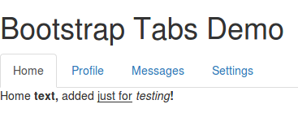
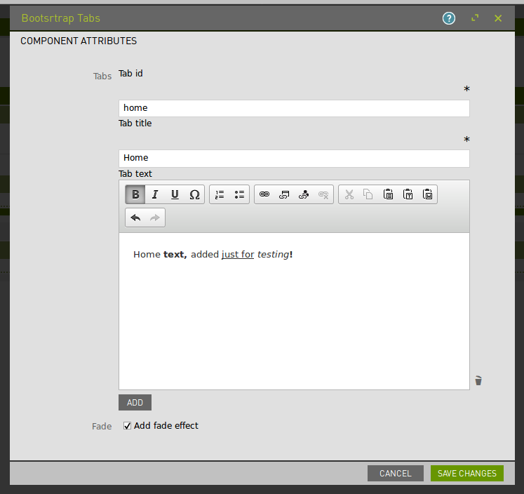

# Bootstrap Tabs

A Bootstrap tabs component for Magnolia

## Features

A Magnolia component that renders a set of Bootstrap (<http://getbootstrap.com>) tabs.

Tabs can be added by the author on the fly and can contain rich content.

The configuration dialog provides three fields for each tab:
* ID
* Title
* (Rich) Text

There is also an option to enable the 'fade' effect when switching tabs.

## Usage

Make the component available to authors, and include the files in `webresources` on your pages using standard magnolia techniques.

(To make this component available on the mtk basic page, you could use the decoration included in `_dev/decorations`.)

This component makes use of the Bootstrap library (<http://getbootstrap.com>), both CSS and JS. This Bootstrap component uses jQuery, so dont' forget to add that as a dependency too.

## Demo

To see a page demonstrating this component, open the Pages app in Magnolia AdminCentral and import the file in `_dev/demos`. (Import it directly at the root of the tree to see an example of the included css styling.)

## Information on Magnolia CMS
This directory is a Magnolia 'light module'.

https://docs.magnolia-cms.com

Search the docs for `sharing light modules` for details on how to share and use light modules on npm and github.

## Contribute to the Magnolia component ecosystem

It's easy to create components for Magnolia and share them on github and npm. I invite you to do so and join the community. Let's stop wasting time by developing the same thing again and again, rather let's help each other out by sharing our work and create a rich library of components.

Just add `magnolia-light-module` as a keyword to npm's package.json to make them easy to find and use on npm.

## License

MIT

## Author

Tricode, http://www.tricode.nl

Martijn Kooijman
